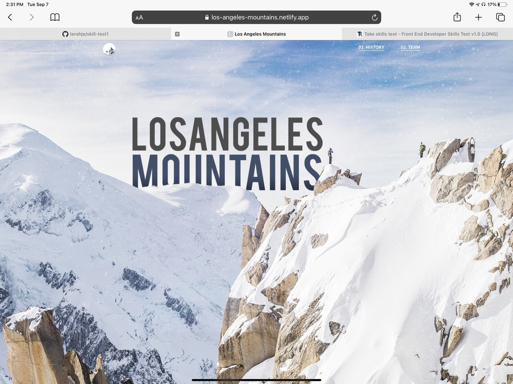

# skill-test1

## Description

A PSD to HTML conversion, I was given a file from which I extracted the images. The instructions called for the site to be fully responsive, and for the carousel to convert to an accordion when on a mobile screen. I used a snippet from bootsnipp.com to make the carousel responsive and bootstrap for the accordion.

[Link to deployed Application](https://649c031736bdd80471cc9965--precious-beijinho-d4177a.netlify.app/)

## Table of Contents

---

## Technologies

- HTML
- CSS
- JavaScript
- Bootstrap

## Usage

## Credits

Carousel - "Bootstrap"
Bootstrap for accordian

## Questions :question:

For further questions on this project or future collaboration contact me at: 

- GitHub: [SristyVerma](https://github.com/sristyverma)
- Email: sristyel2016@gmail.com
- Repository link: [skilltest](https://github.com/SristyVerma/skilltest)
